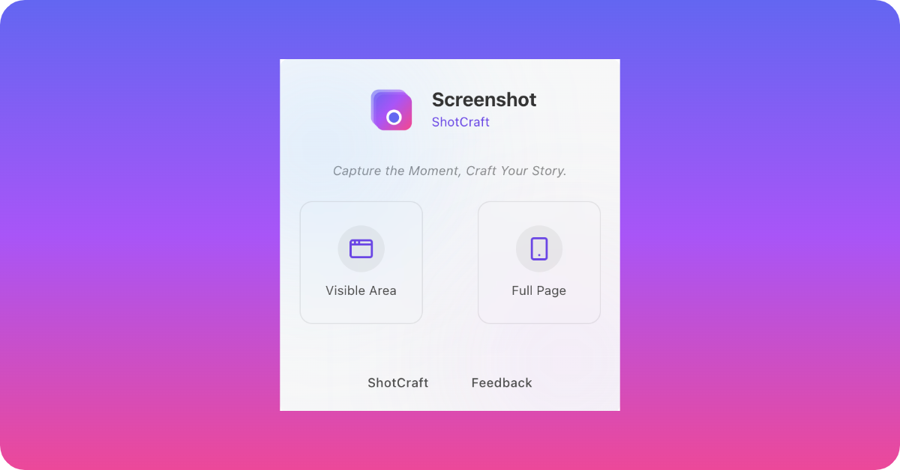

<div align="center">

<h3 align="center">ShotCraft</h3>
    <a href="https://shotcraft.ffutop.com">View Demo</a>
    ·
    <a href="https://github.com/ffutop/shotcraft/issues/new">Report Bug</a>
    ·
    <a href="https://github.com/ffutop/shotcraft/issues/new">Request Feature</a>
  </p>

[English](README.md) |
[中文](README_CN.md)

</div>


# ShotCraft

ShotCraft is a powerful, open-source, web-based tool designed to beautify your screenshots and images instantly. Wrap your images in stunning device mockups, apply beautiful backgrounds, add annotations, and export high-quality results for your social media, blog, or documentation.

## Features

- **Effortless Image Import**: Easily import images via drag & drop, pasting from the clipboard, selecting a file, or even loading directly from a URL.
- **Stunning Device Mockups**: Choose from a wide range of device frames including phones (iPhone), tablets (iPad), laptops (MacBook), and watches (Apple Watch) to give your screenshots a professional look.
- **Rich Background Options**: Select from a curated list of beautiful gradients or any solid color to make your image stand out.
- **Flexible Sizing**:
    - **Presets**: Automatically resize your canvas for popular platforms like Instagram, Twitter, Facebook, and YouTube.
    - **Custom Size**: Define any width and height you need for your project.
    - **Auto Size**: Intelligently determines an optimal size based on your content.
- **Powerful Customization**:
    - **Scale & Position**: Easily zoom and reposition your image within the frame.
    - **Flip**: Flip your image horizontally or vertically with a single click.
    - **Rounded Corners**: Adjust the corner radius of the artboard for a softer look.
    - **Shadow**: Add depth with adjustable drop shadows.
- **Annotation Tools**:
    - Draw basic shapes like Squares, Circles, Lines, and Arrows to highlight important areas.
    - Use a freeform Pencil tool for custom drawings and annotations.
- **High-Quality Export**:
    - Download your final creation as a PNG, JPG, or WEBP file.
    - Export at 1x, 2x, or 3x resolution for crystal-clear results on any display.
    - Quickly copy the final image directly to your clipboard.
- **Modern UI/UX**:
    - A sleek, intuitive, and easy-to-navigate interface.
    - Supports both Light and Dark themes to match your preference.
    - Full canvas zoom and pan controls for precise editing.

## Technology Stack

- **Framework**: React
- **Build Tool**: Vite
- **UI Components**: shadcn/ui
- **Styling**: Tailwind CSS
- **State Management**: Zustand
- **Canvas/Graphics**: LeaferJS
- **Icons**: Lucide React

## Getting Started

To run ShotCraft on your local machine, follow these steps:

1. **Clone the repository:**
    ```bash
    git clone https://github.com/ffutop/shotcraft.git
    cd shotcraft
    ```

2. **Install dependencies:**
    ```bash
    npm install
    ```

3. **Run the development server:**
    ```bash
    npm run dev
    ```
The application will be available at `http://localhost:5173`.

## Deployment

This project is automatically built and deployed to GitHub Pages on every push to the `main` branch, thanks to a pre-configured GitHub Actions workflow.