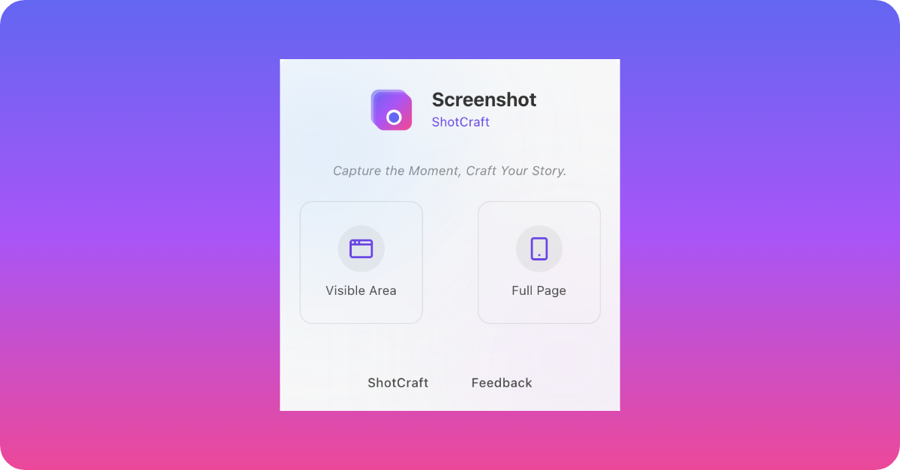

<div align="center">

<h3 align="center">ShotCraft</h3>
    <a href="https://shotcraft.ffutop.com">View Demo</a>
    ·
    <a href="https://github.com/ffutop/shotcraft/issues/new">Report Bug</a>
    ·
    <a href="https://github.com/ffutop/shotcraft/issues/new">Request Feature</a>
  </p>

[English](README.md) |
[中文](README_CN.md)

</div>


# ShotCraft

ShotCraft 是一个功能强大的开源 Web 工具，旨在即时美化您的截图和图片。您可以将图片包裹在精美的设备模型中，应用漂亮的背景，添加标注，并导出高质量的图片，用于您的社交媒体、博客或文档。

## 功能特性

- **轻松导入图片**: 支持拖放、从剪贴板粘贴、选择文件，甚至通过 URL 链接直接加载图片。
- **精美的设备模型**: 提供多种设备外壳选择，包括手机 (iPhone)、平板 (iPad)、笔记本电脑 (MacBook) 和手表 (Apple Watch)，让您的截图看起来更专业。
- **丰富的背景选项**: 从一系列精选的渐变色或任意纯色中进行选择，让您的图片脱颖而出。
- **灵活的尺寸调整**:
    - **预设尺寸**: 为 Instagram、Twitter、Facebook、YouTube 等流行平台自动调整画布大小。
    - **自定义尺寸**: 根据您的项目需求，定义任意宽度和高度。
    - **自动尺寸**: 根据您的内容智能确定最佳画布大小。
- **强大的定制功能**:
    - **缩放与定位**: 在画框内轻松缩放和重新定位您的图片。
    - **翻转**: 单击即可水平或垂直翻转您的图片。
    - **圆角**: 调整画板的圆角半径，获得更柔和的视觉效果。
    - **阴影**: 通过可调节的投影增加图片的深度感。
- **标注工具**:
    - **绘制矩形、圆形、直线和箭头等基本形状**，以突出重要区域。
    - **使用自由的画笔工具进行自定义绘图和标注**。
- **高质量导出**:
    - **将您的最终作品下载为 PNG、JPG 或 WEBP 文件**。
    - **支持 1x、2x 或 3x 分辨率导出**，确保在任何显示设备上都清晰锐利。
    - **快速将最终图像直接复制到剪贴板**。
- **现代化的用户体验**:
    - **简洁、直观且易于操作的界面**。
    - **支持浅色和深色两种主题模式**，以适应您的偏好。
    - **完整的画布缩放和平移控件**，便于进行精确编辑。

## 技术栈

- **框架**: React
- **构建工具**: Vite
- **UI 组件库**: shadcn/ui
- **样式**: Tailwind CSS
- **状态管理**: Zustand
- **画布/图形**: LeaferJS
- **图标**: Lucide React

## 本地开发

要在本地计算机上运行 ShotCraft，请按照以下步骤操作：

1. **克隆仓库:**
    ```bash
    git clone https://github.com/ffutop/shotcraft.git
    cd shotcraft
    ```

2. **安装依赖:**
    ```bash
    npm install
    ```

3. **启动开发服务器:**
    ```bash
    npm run dev
    ```
应用将在 `http://localhost:5173` 上可用。

## 部署

本项目已通过 GitHub Actions 配置，在每次推送到 `main` 分支时，都会自动构建并部署到 GitHub Pages。
